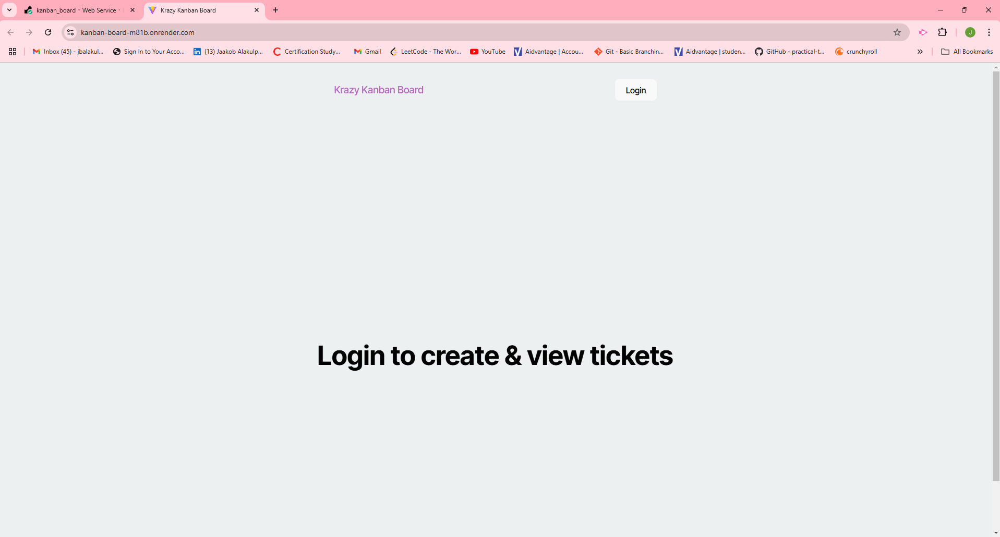
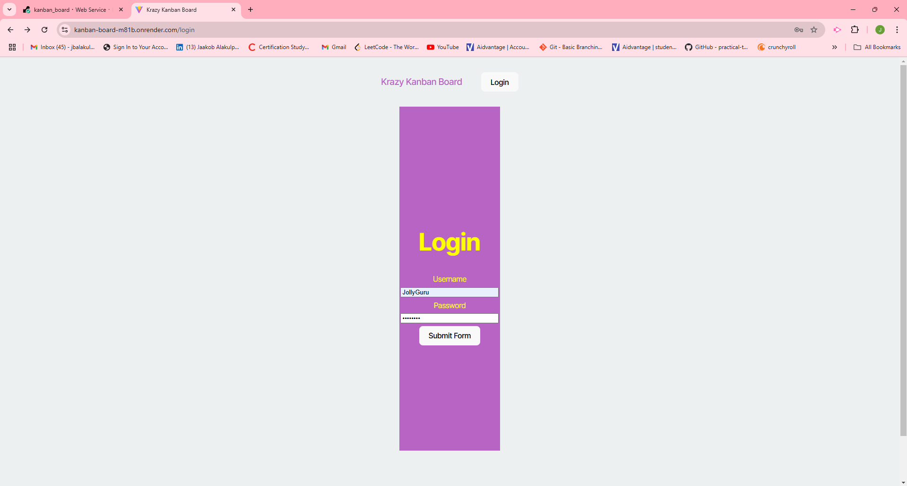
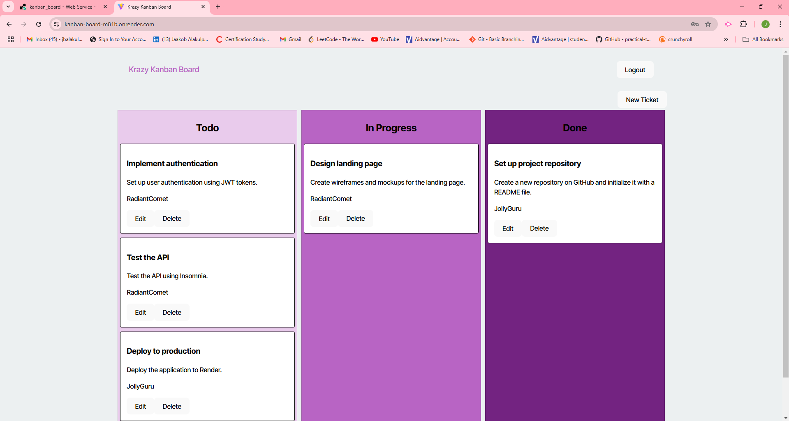
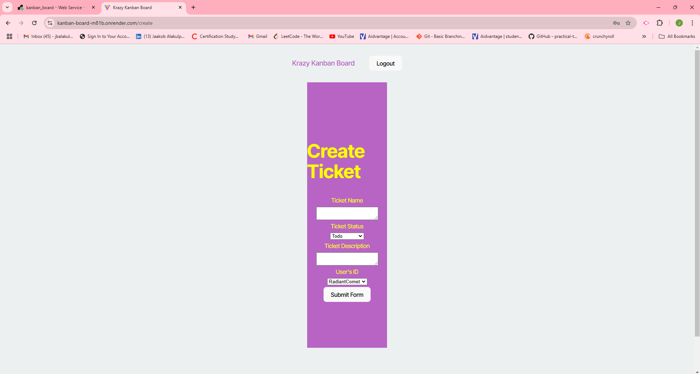

# Kanban Board

## Description
This project is a simple kanban board used to streamline task management. It organizes tasks into three columns: Todo, In Progress, and Done, allowing users to track progress on one screen. Users can add tasks by clicking the new ticket button and filling out the forms to create a ticket. 

## Screenshots

## Link to deployed app
https://kanban-board-m81b.onrender.com